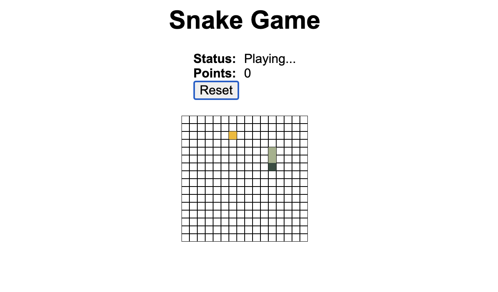

# Snake Game 🐍🎮

A classic Snake game implementation built with Rust and WebAssembly for high-performance web gaming.



## 🌟 Features

- **High Performance**: Built with Rust and compiled to WebAssembly for optimal speed
- **Classic Gameplay**: Traditional snake mechanics with modern web implementation
- **Smooth Controls**: Responsive keyboard controls for fluid gameplay
- **Score Tracking**: Keep track of your high scores
- **Web-Based**: Runs directly in your browser, no installation required

## 🚀 Getting Started

### Play Online
🎮 **[Play the Game Now](https://charrywu.github.io/snake_game/www/public/index.html)**

### Local Development

#### Prerequisites
- [Rust](https://rustup.rs/) (latest stable version)
- [wasm-pack](https://rustwasm.github.io/wasm-pack/installer/)
- [Node.js](https://nodejs.org/) (for the web server)

#### Building from Source
```bash
# Clone the repository
git clone https://github.com/CharryWu/snake_game.git
cd snake_game

# Build the WebAssembly module
wasm-pack build

# Install web dependencies (if applicable)
cd www
npm install

# Start development server
npm start
```

## 🎮 How to Play

1. **Start**: Open the game in your web browser
2. **Controls**: Use arrow keys to control the snake
   - ⬆️ **Up Arrow**: Move up
   - ⬇️ **Down Arrow**: Move down
   - ⬅️ **Left Arrow**: Move left
   - ➡️ **Right Arrow**: Move right
3. **Objective**: Eat the food to grow your snake and increase your score
4. **Avoid**: Don't hit the walls or your own tail!

## 🛠️ Technology Stack

- **Core Game Logic**: Rust
- **Web Interface**: WebAssembly (WASM)
- **Frontend**: HTML5 Canvas, JavaScript
- **Build Tools**: wasm-pack, webpack
- **Performance**: Near-native speed through WebAssembly

## 📁 Project Structure

```
snake_game/
├── src/                 # Rust source code
│   ├── lib.rs          # Main game logic
│   └── utils.rs        # Utility functions
├── www/                # Web interface
│   ├── public/         # Static assets
│   ├── index.html      # Game interface
│   └── index.js        # JavaScript bindings
├── Cargo.toml          # Rust dependencies
├── pkg/                # Generated WASM output
└── README.md           # This documentation
```

## 🔧 Game Architecture

### Rust Core
- Game state management
- Snake movement logic
- Collision detection
- Food generation
- Score calculation

### WebAssembly Bridge
- Efficient memory management
- JavaScript interop
- Canvas rendering optimization
- Input handling

### Web Frontend
- HTML5 Canvas for graphics
- Keyboard event handling
- Game loop management
- UI controls and displays

## 🎯 Game Rules

1. **Movement**: The snake moves continuously in the current direction
2. **Food**: Eating food increases snake length and score
3. **Growth**: Each food item makes the snake one unit longer
4. **Collision**: Game ends if snake hits walls or itself
5. **Scoring**: Points awarded for each food item consumed

## 🚀 Performance Benefits

### Why Rust + WebAssembly?
- **Speed**: Near-native performance for game logic
- **Memory Safety**: Rust's ownership model prevents common bugs
- **Small Bundle Size**: Efficient WASM output
- **Cross-Platform**: Runs on any modern web browser

### Optimization Features
- Efficient memory management
- Minimal JavaScript overhead
- Optimized rendering pipeline
- Responsive input handling

## 🌐 Browser Compatibility

- ✅ Chrome/Chromium 57+
- ✅ Firefox 52+
- ✅ Safari 11+
- ✅ Edge 16+
- 📱 Modern mobile browsers

## 🤝 Contributing

This project is part of the [webtools](https://github.com/CharryWu/webtools) collection. To contribute:

1. Fork the repository
2. Create a feature branch
3. Make your changes
4. Test thoroughly
5. Submit a pull request

### Development Setup
```bash
# Install Rust and wasm-pack first
curl --proto '=https' --tlsv1.2 -sSf https://sh.rustup.rs | sh
curl https://rustwasm.github.io/wasm-pack/installer/init.sh -sSf | sh

# Clone and build
git clone https://github.com/CharryWu/snake_game.git
cd snake_game
wasm-pack build
```

## 📚 Learning Resources

- [Rust Book](https://doc.rust-lang.org/book/)
- [WebAssembly Documentation](https://webassembly.org/docs/)
- [wasm-pack Guide](https://rustwasm.github.io/docs/wasm-pack/)
- [Rust and WebAssembly Book](https://rustwasm.github.io/docs/book/)

## 📄 License

This project is open source and available under standard terms as part of the webtools collection.

---

**Source Code**: [GitHub Repository](https://github.com/CharryWu/snake_game) • **Created by Charry Wu** • [More Projects](https://charrywu.github.io/webtools/)
