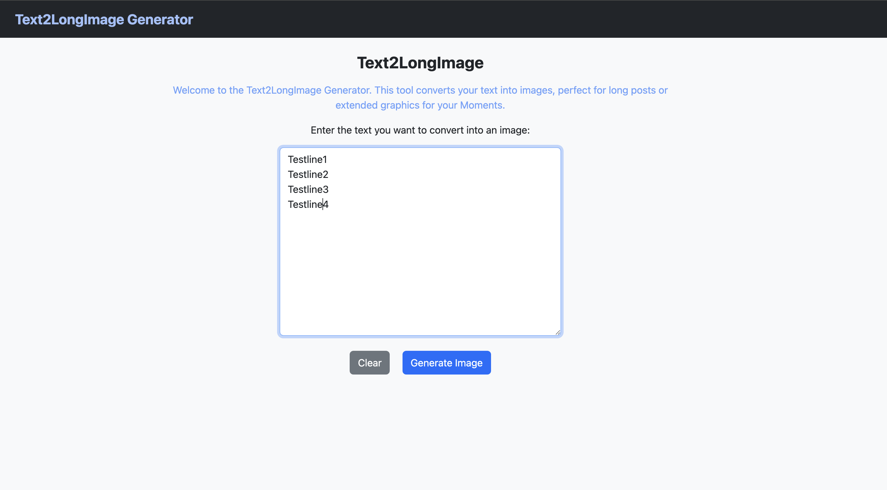

# Text2LongImage 📝✨

Transform your text into beautiful long images perfect for social media posts and mobile reading.



## 🌟 Features

### Core Functionality
- **Text to Image Conversion**: Convert text paragraphs into PNG images
- **Smart Text Justification**: Automatic line breaks for both CJK (Chinese/Japanese/Korean) and English text
- **Dark/Light Mode**: Generate images with light or dark themes
- **Mobile Optimized**: Perfect for long posts on social media platforms

### History Management
- **Auto-Save**: Text automatically saved to browser localStorage
- **History Tiles**: View previously entered texts in chronological order
- **Quick Actions**: View, copy, delete, and reuse saved texts
- **Smart Storage**: Keeps the 50 most recent entries, prevents duplicates

### Advanced Annotation System
- **Interactive Highlighting**: Click and drag to highlight text on generated images
- **Real-time Preview**: See highlights as you drag your mouse
- **Zoom Controls**: Zoom in/out (0.5x to 3x) with floating controls
- **Multiple Highlights**: Add multiple separate text highlights
- **Precise Selection**: Character-level precision for accurate text selection

## 🚀 Getting Started

### Quick Start
1. Open `index.html` in your web browser
2. Type or paste your text in the textarea
3. Click "Convert" or "Convert (Dark)" to generate your image
4. Right-click the generated image to save or use the Download button

### Advanced Usage

#### Text Annotation
1. Generate your text image
2. Click the "Annotate" button to enter annotation mode
3. Use zoom controls (+, -, home icon) to adjust view
4. Click and drag to highlight specific text portions
5. Use "Clear Highlights" to remove all annotations
6. Click "Exit Annotate" to return to normal view

#### History Management
- Previous texts appear as tiles on the right side
- Click "view" to see full text content
- Click "use this" to load text back into the editor
- Click "×" to delete individual entries
- Use "Delete All" to clear entire history

## 🛠️ Technology Stack

- **Frontend**: Vanilla HTML, CSS, JavaScript
- **Styling**: Bootstrap 5.3.3
- **Storage**: Browser localStorage
- **Canvas API**: For image generation and annotation
- **Text Processing**: Smart CJK/English text justification algorithms

## 📁 Project Structure

```
text2longimage/
├── index.html              # Main application interface
├── style.css              # External stylesheet
├── text2longimage.js      # Core application logic
├── justify-text-online.js # Text justification utilities
├── text2longimage1.png    # Demo screenshot 1
├── text2longimage2.png    # Demo screenshot 2
└── README.md              # This documentation
```

## 🎨 Configuration Options

The application uses configurable parameters for image generation:

```javascript
const DEFAULT_IMG_CONFIG = {
  charsPerLine: 18,        // Characters per line
  fontSize: 32,            // Font size in pixels
  lineSpacing: 1.5,        // Line height multiplier
  fontWeight: "400",       // Font weight
  padding: 42,             // Image padding in pixels
};
```

## 🔧 Key Functions

### Text Processing
- `justifyText()`: Smart text justification for mixed CJK/English content
- `isCJK()`: Detect Chinese/Japanese/Korean characters
- `textToImg()`: Convert text to canvas-based image

### History Management
- `saveTextToHistory()`: Auto-save user input
- `displayTextHistory()`: Render history tiles
- `deleteTextEntry()`: Remove specific entries

### Annotation System
- `toggleAnnotationMode()`: Enter/exit annotation mode
- `handleCanvasMouseDown/Move/Up()`: Mouse interaction handlers
- `addHighlight()`: Create persistent text highlights
- `zoomIn/Out/Reset()`: Zoom control functions

## 🌏 Internationalization

The application intelligently handles multiple languages:
- **CJK Languages**: Character-based line breaking for Chinese, Japanese, Korean
- **English/Latin**: Word-based line breaking with proper spacing
- **Mixed Content**: Seamlessly handles documents with multiple languages

## 📱 Browser Compatibility

- ✅ Chrome/Chromium (recommended)
- ✅ Firefox
- ✅ Safari
- ✅ Edge
- 📱 Mobile browsers supported

## 🤝 Contributing

This is part of the [webtools](https://github.com/CharryWu/webtools) collection. Feel free to:
- Report bugs
- Suggest features
- Submit pull requests
- Share usage examples

## 👥 Credits & Attribution

**Original Author**: [@CharryWu](https://github.com/CharryWu) - Initial text-to-image conversion functionality and core algorithms

**Enhanced by Cursor AI**: Significant feature additions and improvements including:
- **History Management System**: localStorage integration for saving and managing previous texts
- **Advanced Annotation System**: Interactive text highlighting with zoom controls and real-time preview
- **UI/UX Improvements**: Text tiles, modal interfaces, and responsive design enhancements
- **Code Organization**: Modular architecture and comprehensive documentation

This project represents a collaborative effort between human creativity and AI-assisted development, showcasing how AI tools can enhance and extend existing codebases with sophisticated new features.

## 📄 License

This project is open source and available under standard terms as part of the webtools collection.

---

**Originally Created by Charry Wu** • **Enhanced by Cursor AI** • [View Source](https://github.com/CharryWu/webtools/tree/main/text2longimage) • [More Tools](https://charrywu.github.io/webtools/)
